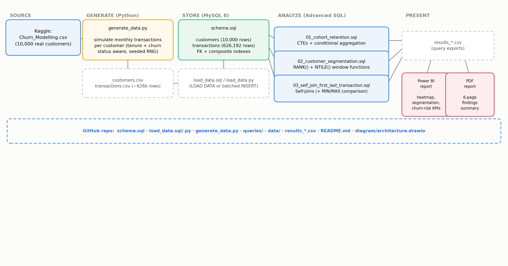

# Bank Customer Churn Analysis (Advanced MySQL)

A SQL portfolio project analyzing churn, retention, and customer value for a
retail bank, built to showcase window functions, CTEs, conditional
aggregation, and self-joins in MySQL 
## Architecture



Source data → simulated transaction generation → MySQL → three advanced-SQL
analyses → exported results → Power BI report + PDF summary. Editable source
for the diagram is in [`diagram/architecture.drawio`](diagram/architecture.drawio)
(open at [app.diagrams.net](https://app.diagrams.net) or the draw.io desktop/VS Code extension).

## Key findings

| | |
|---|---|
| Overall churn rate | **20.4%** (2,037 of 10,000 customers) |
| Platinum-tier churn vs. Bronze-tier churn | **8.8% vs. 26.0%** — ~3x gap |
| Customers "at risk" (90+ days quiet, not yet formally churned) | **572 (5.8%)** — invisible to standard churn reporting |
| Retention drop-off | Steepest in month 1 after signup; flattens by month 6 |

Full write-up with charts: [`reports/bank_churn_analysis_report.pdf`](reports/bank_churn_analysis_report.pdf).

## Business context

A bank wants to answer three questions about its ~10,000 customers:

1. **Retention** — of customers who joined in a given month, how many are
   still active 1 / 3 / 6 / 12 months later? Is retention improving cohort
   over cohort?
2. **Value segmentation** — who are the highest-value customers overall,
   and in each market? Does churn risk differ by value tier?
3. **Recency / lifespan** — how long has each customer been with the bank,
   and how long since their last transaction? Which active (not-yet-
   labeled-churned) customers are actually going quiet?

## Data

- `data/customers.csv` — 10,000 customers from the classic Kaggle-style
  **Churn_Modelling** dataset (CreditScore, Geography, Age, Tenure,
  Balance, NumOfProducts, IsActiveMember, EstimatedSalary, Exited, etc.),
  extended with two derived columns:
  - `signup_date` — back-calculated from each customer's real `Tenure`
    (years with the bank), jittered within the year so signup cohorts
    spread naturally across months.
  - `churn_date` — for the 2,037 customers with `Exited = 1`, a date within
    their tenure when they stopped transacting.
- `data/transactions.csv` — **~626,000 rows**. The source dataset has no
  transaction-level activity, so this project simulates a realistic
  monthly transaction log per customer (`generate_data.py`) from their
  signup date to either their churn date (if churned) or the extract date,
  with irregular monthly activity (active members transact more often than
  inactive ones) and amounts scaled off each customer's real balance/salary.
  This is what makes cohort retention and recency analysis possible — the
  customer attributes themselves are real, the activity pattern is
  simulated but grounded in each customer's real tenure/churn/activity
  status. Reproducible via a fixed random seed.
- Dataset extract date (used as "today" throughout the queries):
  **2026-06-30**.

## Project structure

```
schema.sql                                  -- CREATE TABLE (customers, transactions)
load_data.sql                                -- LOAD DATA LOCAL INFILE loader
load_data.py                                  -- Python fallback loader (mysql-connector-python)
generate_data.py                              -- regenerates data/*.csv from Churn_Modelling.csv
data/
  customers.csv
  transactions.csv
  source_Churn_Modelling.csv                 -- original real dataset, for provenance
queries/
  01_cohort_retention.sql                    -- CTEs + conditional aggregation
  02_customer_segmentation.sql               -- RANK() + NTILE()
  03_self_join_first_last_transaction.sql    -- self-joins
results/
  cohort_retention_matrix.csv                -- query 1 output
  customer_segmentation.csv                  -- query 2 output
  first_last_transaction_churn_risk.csv      -- query 3 output
reports/
  bank_churn_analysis_report.pdf             -- 6-page findings write-up
diagram/
  architecture.drawio                        -- editable source (draw.io)
  architecture.png                           -- rendered version, embedded above
```

## How to run

```bash
mysql -u root -p < schema.sql

# Option A — fast path, if your MySQL allows local infile:
mysql --local-infile=1 -u root -p < load_data.sql

# Option B — if LOAD DATA is locked down (managed MySQL, some local setups):
pip install mysql-connector-python
python load_data.py --user root --password yourpw

# then run whichever analysis you want:
mysql -u root -p bank_churn_analysis < queries/01_cohort_retention.sql
```

## The three queries

### 1. Cohort retention (`queries/01_cohort_retention.sql`)
Groups customers into monthly signup cohorts (a CTE), then uses
**conditional aggregation** (`COUNT(DISTINCT CASE WHEN month_number = N
THEN customer_id END)`) to pivot each cohort's activity into a classic
retention matrix — cohort rows, month-since-signup columns. Includes both
a long-format version (easy to chart) and the pivoted matrix (the format
most people picture when they say "cohort retention table").

### 2. Customer value segmentation (`queries/02_customer_segmentation.sql`)
Aggregates each customer's total transaction value, then uses:
- `NTILE(4)` to split the whole customer base into value quartiles
  (Platinum/Gold/Silver/Bronze)
- `RANK()` partitioned by `geography` to find each customer's standing
  within their own market

A follow-up query cross-tabs value tier against churn rate — a natural
next question interviewers ask ("okay, so what did you find?").

### 3. First vs. last transaction (`queries/03_self_join_first_last_transaction.sql`)
Finds each customer's first and last transaction date using an actual
**self-join** (`LEFT JOIN transactions b ON ... WHERE b.transaction_id IS
NULL` — keep rows with no earlier/later match), then derives active
lifespan and days-since-last-transaction to flag churn risk. Also includes
the equivalent `MIN()`/`MAX()` + `GROUP BY` version for comparison — worth
knowing both, since interviewers sometimes ask you to do it "without an
aggregate function."

## Talking points for an interview walkthrough

- Why simulate transactions instead of using the raw dataset as-is: the raw
  dataset is a single snapshot with no dates, so none of retention,
  cohorts, or recency analysis is possible without transaction-level
  history — explain the tradeoff (grounded-but-simulated data) honestly.
- `RANK()` vs `DENSE_RANK()` vs `ROW_NUMBER()` — and why `RANK()` was the
  right choice for geography leaderboards (ties should share a rank).
- Self-join vs `MIN()`/`MAX()`: the self-join is O(n²)-ish without a tight
  index and mostly exists to demonstrate the technique; in production
  you'd use the aggregate version — say this proactively, it shows
  judgment rather than just "knowing the syntax."
- The `idx_customer_date` composite index on `transactions(customer_id,
  transaction_date)` is what keeps the self-join and window-function
  queries from doing full table scans — check with `EXPLAIN`.
